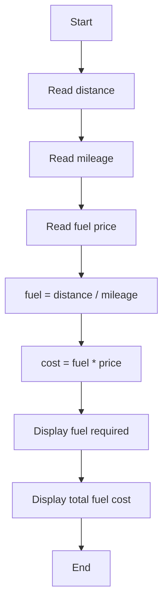

# Challenge-02

A C program that calculates the fuel required for a journey and the total fuel cost.

## Problem Statement

Write a C program to:
- accept distance, mileage, and fuel price
- calculate fuel required
- calculate total fuel cost

## Formula

- Fuel required = distance / mileage
- Total fuel cost = fuel required × fuel price

## Algorithm

1. Start
2. Read distance
3. Read mileage
4. Read fuel price
5. Compute fuel = distance / mileage
6. Compute cost = fuel × price
7. Display fuel required
8. Display total fuel cost
9. Stop

## Flowchart



## Compile and Run

```sh
gcc Challenge-02.c -o Challenge-02
./Challenge-02
```

## Example

### Input
```text
Enter distance in km: 450
Enter mileage of vehicle: 15
Enter fuel price per litre: 105
```

### Output
```text
Fuel required = 30.000000 litres
Total fuel cost = Rs 3150.000000
```

## Test Cases & Results

### Test Case 1
Input:
```text
Distance = 450
Mileage = 15
Fuel Price = 105
```

Output:
```text
Fuel Required: 30.00 litres
Total Fuel Cost: Rs 3150.00
```

### Test Case 2
Input:
```text
Distance = 300
Mileage = 20
Fuel Price = 100
```

Output:
```text
Fuel Required: 15.00 litres
Total Fuel Cost: Rs 1500.00
```

### Test Case 3
Input:
```text
Distance = 500
Mileage = 18
Fuel Price = 105
```

Output:
```text
Fuel Required: 27.78 litres
Total Fuel Cost: Rs 2916.67
```

### Test-case Table

| Test Case | Distance (km) | Mileage (km/L) | Fuel Price (₹/L) | Fuel Required (L) | Total Cost (₹) |
|----------|---------------|----------------|------------------|-------------------|----------------|
| 1 | 450 | 15 | 105 | 30.00 | 3150.00 |
| 2 | 300 | 20 | 100 | 15.00 | 1500.00 |
| 3 | 500 | 18 | 105 | 27.78 | 2916.67 |
